# Groove Pico - Groove Coaster Style Mini Controller
[点这里可以切换到中文版](README_CN.md)

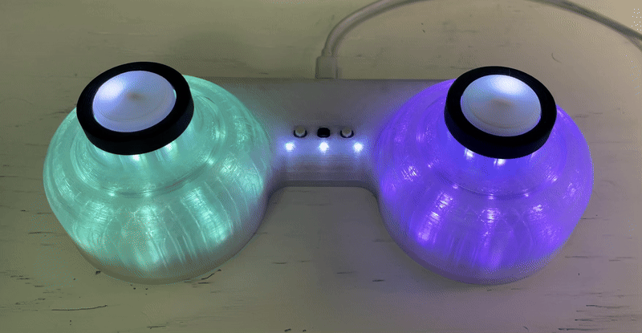

Features:
* It's small but closely replicates the feel of the arcade controller.
* Works as a Nintendo Switch controller.
* Stereo haptic feedback.
* Command line for configurations.
* All source files open.

Thanks to many respectful guys/companies who made their tools or materials free or open source (KiCad, OnShape, InkScape, Raspberry things).

Special thanks to community developers that inspired me and helped me: CrazyRedMachine (https://github.com/CrazyRedMachine), asesidaa (https://github.com/asesidaa).

## Notes
You can check out my other cool projects.

* Popn Pico: https://github.com/whowechina/popn_pico
* IIDX Pico: https://github.com/whowechina/iidx_pico
* IIDX Teeny: https://github.com/whowechina/iidx_teeny
* Chu Pico: https://github.com/whowechina/chu_pico
* Mai Pico: https://github.com/whowechina/mai_pico
* Diva Pico: https://github.com/whowechina/diva_pico
* AIC Pico: https://github.com/whowechina/aic_pico
* Groove Pico: https://github.com/whowechina/groove_pico

This Groove Pico project:  
* Heavily depends on 3D printing, you need a 3D printer.
* Requires skills to solder tiny components.

## **Disclaimer** ##
I made this project in my personal time with no financial benefit or sponsorship. I will continue to improve the project. I have done my best to ensure that everything is accurate and functional, there's always a chance that mistakes may occur. I cannot be held responsible for any loss of your time or money that may result from using this open source project. Thank you for your understanding.

## About the License
It's CC-NC. So DIY for yourself and for your friend, don't make money from it.

## HOW TO BUILD
### PCB
* Go JLCPCB and make order with the gerber zip file (latest `Production\PCB\groove_main_xxx.zip`), regular FR-4 board, black or white color, **1.6mm** thickness.  
  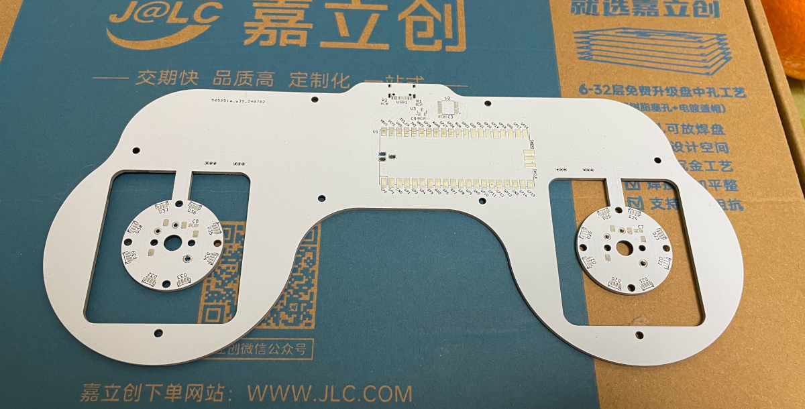
* 1x Rasberry Pico Pi Pico or pin-to-pin compatible clones (U1).  
  https://www.raspberrypi.com/products/raspberry-pi-pico
* 1x USB Type-C socket (918-418K2023S40001 or KH-TYPE-C-16P)
* 24x WS2812B-4020 side-facing RGB LEDs for the circular gimbal daughter PCBs (D20-D43).  
  https://www.lcsc.com/product-detail/Light-Emitting-Diodes-LED_Worldsemi-WS2812B-4020_C965557.html
* 19x WS2812B-3528 RGB LEDs for the main PCB (D1-D19).
* 1x 74HC4052PW, TSSOP16 package (U2).  
  https://www.lcsc.com/product-detail/Multiplexer-Demultiplexer_Nexperia-74HC4052PW_50063.html
* 2x 2N7002 N-Channel MOSFETs (Q1, Q2). Actually most SOT-23 package N-Channel MOSFET models will be fine.  
  https://www.nexperia.com/products/mosfets/small-signal-mosfets/2N7002.html
* 4x SH 1.25mm 3-pin connectors, both through-hole and SMD types are acceptable.  
  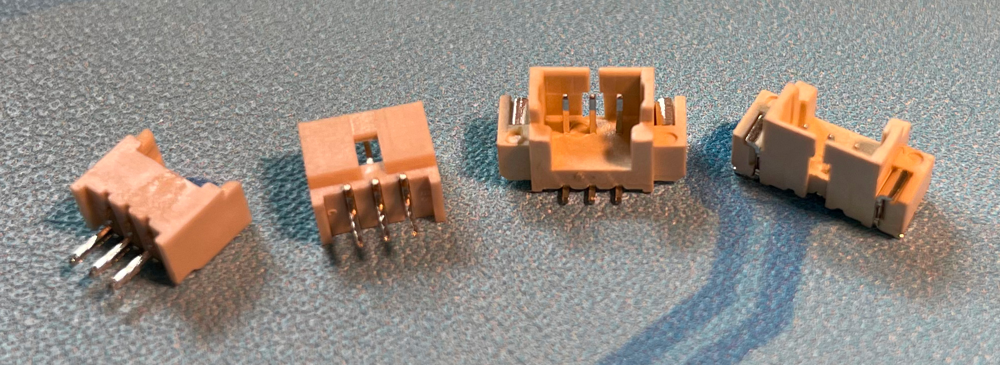
* 8x 0603 0.1uF (0.1~1uF all fine) capacitors (C1 to C8), OPTIONAL but strongly recommended.
* 2x 0603 5.1kohm resistors (R1, R2) for the USB.
* 5x 0603 10ohm resistors, (1-20ohm all work fine) (R3-R7).
* Just leave U3 and C9 empty. They're for stabilizing the ADC reference voltage, but I think it's just a placebo effect.
* 2x Kailh choc v1 switches, use light linear ones (around 35gf), such as "Red Pro".  
  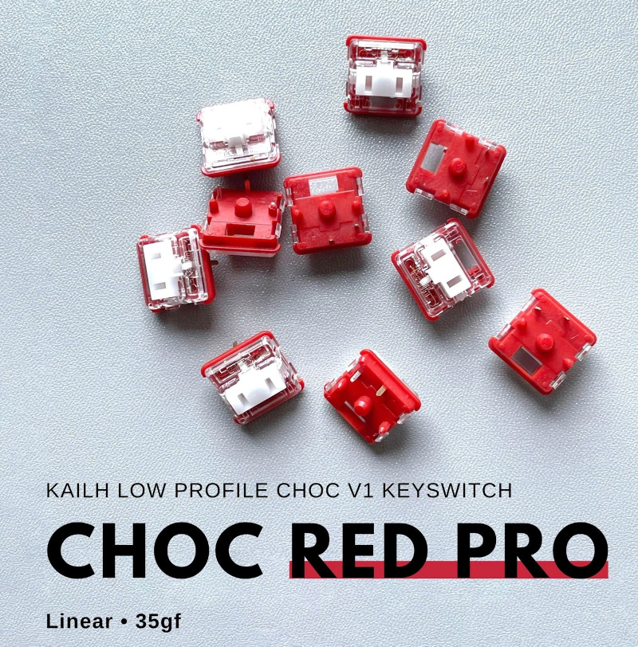
* 3x ALPS SKPMAME010 or Panasonic EVQP1K05M 6mm square tactile switches, You can use either one exclusively or a combination of both.  
  https://tech.alpsalpine.com/e/products/detail/SKPMAME010/  
  https://www3.panasonic.biz/ac/e/dl/catalog/index.jsp?series_cd=3473&part_no=EVQP1K05M
* 2x BETAFPV nano gimbals (Potentiometer, Pitch/Roll Stick). You can buy them from online RC or FPV shops. Some call "Pitch/Roll stick" as directional stick which provides auto-center for both axes.  
  https://betafpv.com/products/literadio-transmitter-nano-gimbal-for-literadio-3-and-2-se?variant=39628763529350
* 2x 1027 or 1030 DC 3V flat vibration motors.  
  https://www.amazon.com/vibration-electronic-equipment-12000RPM-adhesive/dp/B08B34W24X
* 2x M3 hex nuts.
* This is how it looks after soldering. Please note that the two circular daughter PCBs are fully wired, so you can test them before cutting them off.  
  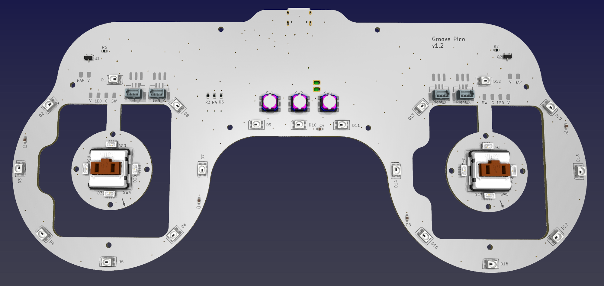  
  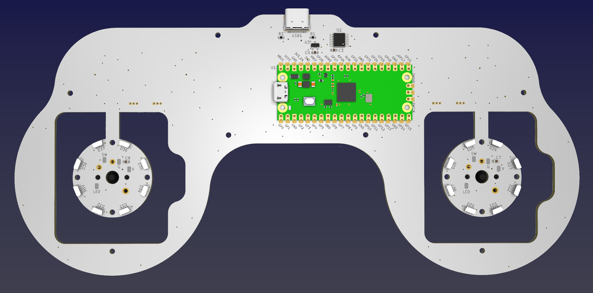
* Becareful of 3 pin holes (simplifed to 2 holes in latest version) on the top side. It's a common oversight to either forget to solder them or to leave air bubbles during the process. To avoid this, solder slowly from one side of the hole, using minimal solder wire and a generous amount of flux.  
  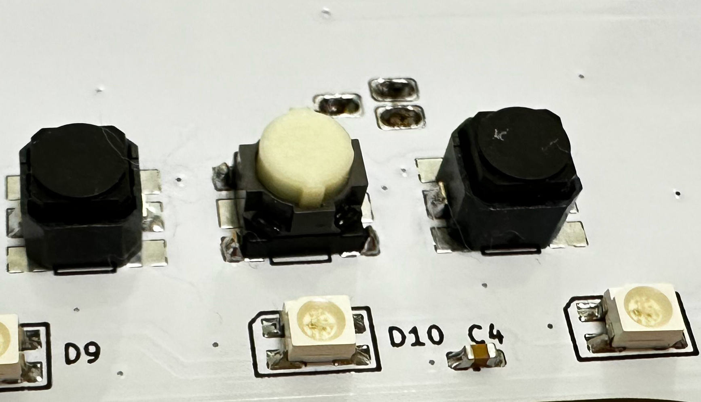
* After it passes the test, you need to cut the circular daughter PCBs off.  
  
  
  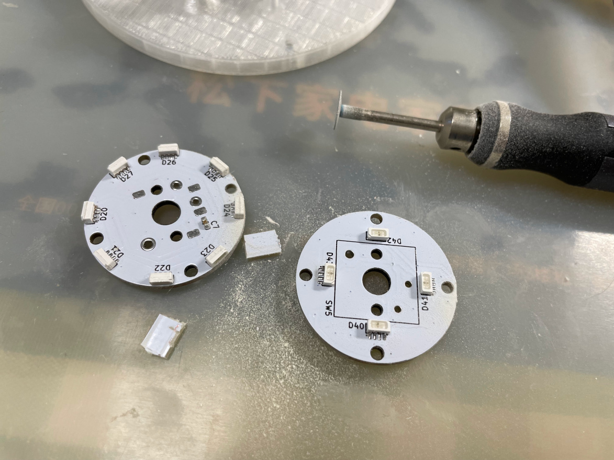

### 3D Printing
* Printing parameters  
  * PLA, PETG, ABS are all OK.
  * Layer height: 0.2mm
  * Support: Yes, always.

* Bottom Part: `Production\3DPrint\groove_pico_bottom.stl`, semi-transparent filament.
* Top Part: `Production\3DPrint\groove_pico_top.stl`, semi-transparent filament.
* Gimbal Stick: `Production\3DPrint\groove_pico_stick.stl`, semi-transparent filament. If you have Bambu AMS system, print the upper (above 22mm) layers with black filament.
* Gimbal Bolt: `Production\3DPrint\groove_pico_bolt.stl`, white filament.
* Gimbal Tightener: `Production\3DPrint\groove_pico_tightener.stl`, white filament.
* Button cap: `Production\3DPrint\groove_pico_button_cap.stl`, white filament, print up-side down so you get nice button surface and stem. If you have Bambu AMS system, use their special support material for the interface layer.

### Assembly
* Other components needed
  * 20x **M2\*4mm regular screws** to fix main PCB and daughter PCBs.
  * 20x **M2.5\*8mm regular screws** to fix the Nano Gimbals and hold bottom and top parts together.
  * 7x **10\*2** or **10\*3** (10mm diameter, 2mm or 3mm height) **self-adhesive silicone anti-slip pads** to stick to the bottom part.  
    
  * 30AWG or 32AWG ultra-thin silicone (very soft) wires, better to have them in 4 colors.  
    https://www.amazon.com/StrivedayTM-Flexible-Silicone-electronic-electrics/dp/B01KQ2JNLI?th=1
* Steps
  * Solder 4 thin silicone wires to gimbal PCBs and twist them together like a braid. It would be easier if you have different colors. My mapping is red to V, black to G, blue to LED and yellow to SW.  
    
  * Install the main PCB onto the printed base, using M2 screws.
  * Attach 2 silicone wires for each motors to the main PCB, and twist them respectively.
  * Install the BETAFPV Nano Gimbals onto the printed base part using M2.5 screws. Connect the potentiometer connectors to the main PCB.  
    
  * Install the printed bolt to the shaft for both gimbals. You need to turn the bolts until there's no screw thread and then push it to the bottom.  
    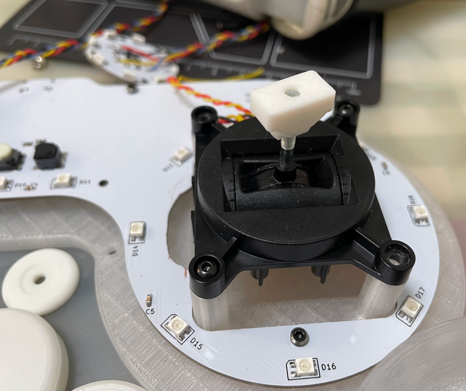
    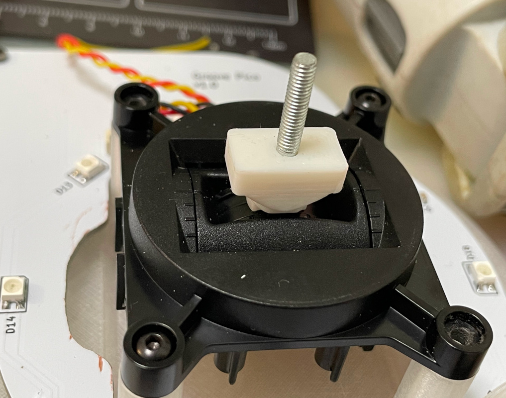
  * Install the printed stick onto the shaft for both gimbals. You need to use a little force to push it in.  
    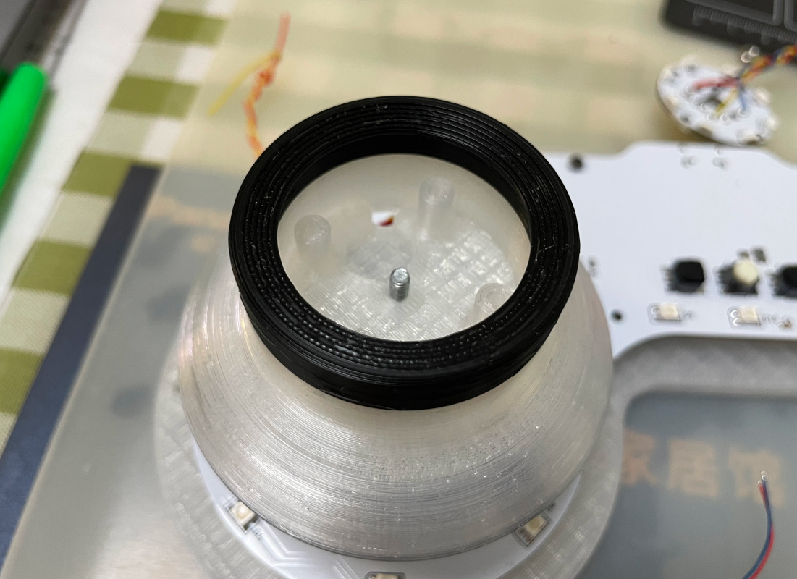
    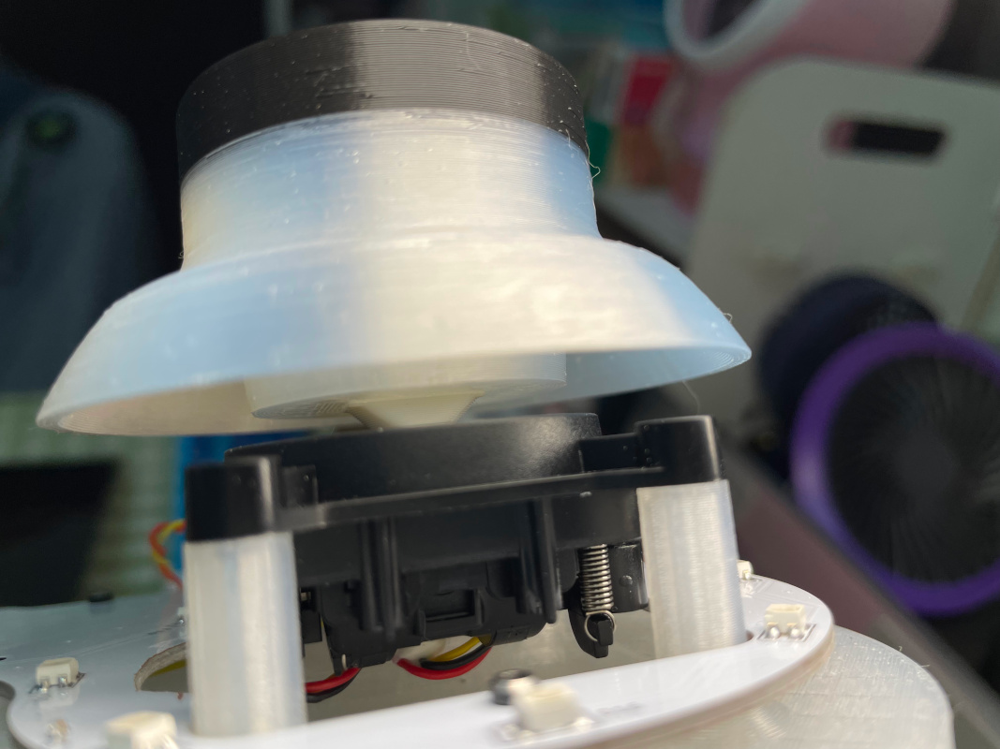
  * Install the flat vibration motor and the gimbal PCB onto the stick and guide the wires through the hole. Finally, use the printed tightener and a hex nut to fix the stick.  
    
    
  * Fix the gimbal PCB to the stick using M2 screws, paying special attention to the direction.  
    
  * Solder the wires for the gimbal PCBs and motors to the corresponding pads on the main PCB. Please reserve some extra wire length for the gimbal movement. Some duct tape can be used to fix the wires on the main PCB.  
    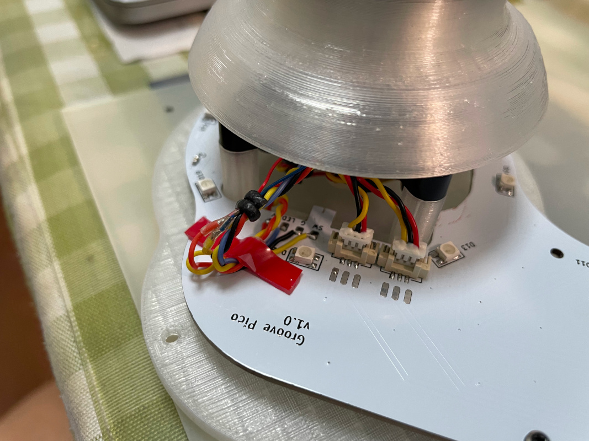
    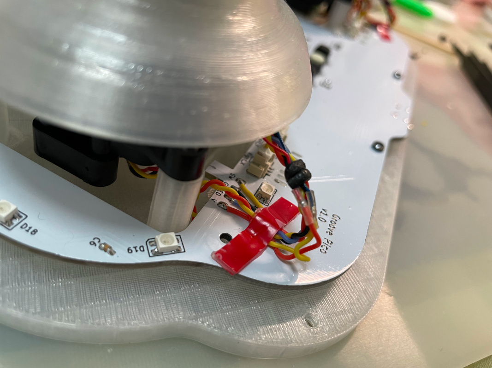
  * Now attach the printed top part to the bottom part with M2.5 screws. And apply anti-slip pads on the bottom side.  
    
  * If everything works fine, push the printed button caps onto the Choc switches and done!  
    

### Firmware
* UF2 file is in `Production\Firmware` folder.
* For the new build, hold the BOOTSEL button while connect the USB to a PC, there will be a disk named "RPI-RP2" showed up. Drag the UF2 firmware binary file into it. That's it. There's a small hole at the bottom side of the Groove Pico, it is facing right to the BOOTSEL button.
* If it's already running Groove Pico firmware, you can either use "update" in command line or hold down all 3 buttons while connecting to USB to enter update mode.
* To access the command line, you can use this Web Serial Terminal to connect to the USB serial port of the Groove Pico. (Note: "?" is for help)  
  https://googlechromelabs.github.io/serial-terminal/
* **NOTE:** You need to calibrate the gimbals by "gimbal calibrate" command after you flash the firmware.

## CAD Source File
I'm using OnShape free subscription. It's powerful but it can't archive original designs to local, so I can only share the link here. STL/DXF/DWG files are exported from this online document.  
  https://cad.onshape.com/documents/97629d37ec7dd45f32c42fed/w/4cdf2d6010b5ce7b9283904a/e/c8e2720760e1863ce3a69460?renderMode=0&uiState=6693eade6539e17fa80ec4fb
