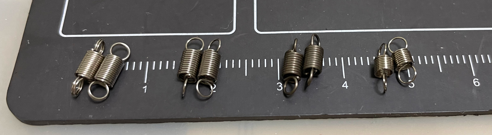

# Groove Pico - 节奏过山车风格的迷你控制器
[Click here for the English version of this guide.](README.md)

特性:
* 它很小，但尽量还原街机控制器的感觉。
* 模拟为任天堂 Switch 控制器来工作。
* 左右独立的振动反馈。
* 使用命令行进行参数配置。
* 所有源文件开放。

感谢许多尊敬的爱好者和公司将他们的工具或材料免费或开源（KiCad，OnShape，InkScape，Raspberry 相关工具, 嘉立创）。

感谢社区开发者的启发和帮助，比如 CrazyRedMachine (https://github.com/CrazyRedMachine), asesidaa (https://github.com/asesidaa).

还有：
* RP_Silicon_KiCad: https://github.com/HeadBoffin/RP_Silicon_KiCad
* Type-C: https://github.com/ai03-2725/Type-C.pretty

## 其他项目
你也可以查看我其他的酷炫项目。

             

* Popn Pico: https://github.com/whowechina/popn_pico
* IIDX Pico: https://github.com/whowechina/iidx_pico
* IIDX Teeny: https://github.com/whowechina/iidx_teeny
* Chu Pico: https://github.com/whowechina/chu_pico
* Mai Pico: https://github.com/whowechina/mai_pico
* Diva Pico: https://github.com/whowechina/diva_pico
* AIC Pico: https://github.com/whowechina/aic_pico
* Groove Pico: https://github.com/whowechina/groove_pico
* Geki Pico: https://github.com/whowechina/geki_pico
* Musec Pico: https://github.com/whowechina/musec_pico
* Ju Pico: https://github.com/whowechina/ju_pico
* Bishi Pico: https://github.com/whowechina/bishi_pico
* Bishi Pico: https://github.com/whowechina/nos_pico

## **声明** ##
我在个人时间内制作了这个项目，没有任何经济利益或赞助。我将继续改进这个项目。我已尽我所能确保所有内容的准确性和功能性，但总有可能出现错误。如果你因使用这个开源项目而造成时间或金钱的损失，我不能负责。感谢你的理解。

## 关于许可证
它是 CC-NC 授权。所以你只能给自己和你的朋友 DIY，不能利用这个项目赚钱，比如收费的代做，出售整机等，连源作者都不敢提的抄袭或者稍微改改换个名字来打擦边球就更不可以了。注意团购和拼单订购原始元器件是合理的，非盈利的方式卖掉剩余的元器件也是可以接受的。

如果希望找我购买成品或者商用授权，请联系我（Discord，QQ 群，闲鱼，微信群或者在 issue 区留下你的联系方式）。

## 我的 Discord 服务器邀请
https://discord.gg/M8f2PPQFEA

## 如何制作
### PCB
* 前往 JLCPCB 下单，使用最新的 `Production\PCB\groove_main_xxx.zip` 文件，选择常规 FR-4 板材，黑色或者白色均可，厚度为 **1.6mm**。  
  
* 1x 树莓派 Pico 或者引脚 1:1 全兼容的克隆版本。  
  https://www.raspberrypi.com/products/raspberry-pi-pico
* 1x USB Type-C 插座 (918-418K2023S40001 或 KH-TYPE-C-16P)
* 24x WS2812B-4020 侧向发光 RGB LED，用在两块摇杆 PCB 上 (D20-D43)。  
  https://www.lcsc.com/product-detail/Light-Emitting-Diodes-LED_Worldsemi-WS2812B-4020_C965557.html
* 19x WS2812B-3528 RGB LED，用在主 PCB 上 (D1-D19)。
* 1x 74HC4052PW, TSSOP16 封装 (U2).  
  https://www.lcsc.com/product-detail/Multiplexer-Demultiplexer_Nexperia-74HC4052PW_50063.html
* 2x 2N7002 SOT-23 N-沟道 MOSFET (Q1, Q2)。其实绝大部分 SOT-23 封装的 N 沟道 MOSFET 都能用。  
  https://www.nexperia.com/products/mosfets/small-signal-mosfets/2N7002.html
* 4x SH 1.25mm 3 针插座, 通孔或者贴片的都可以。  
  
* 8x 0603 0.1uF (0.1~1uF 都行) 贴片电容 (C1 to C8), 可选，但是最好都焊上。
* 2x 0603 5.1kohm 贴片电阻 (R1, R2) ，用于 USB 电流识别。
* 5x 0603 10ohm 贴片电阻，(1-20ohm 都行) (R3-R7)。
* U3 和 C9 不用焊接。它们是用来稳定 ADC 参考电压的，但我认为这只是心理安慰。
* 2x 凯华巧克力 v1 键轴，用轻力度的线线性轴 (35 克力上下的)，比如下面这个 "Red Pro".  
  
* 3x ALPS SKPMAME010 或者松下 EVQP1K05M 6 毫米 方型轻触开关，这俩都能用，你甚至可以组合使用。  
  https://tech.alpsalpine.com/e/products/detail/SKPMAME010/  
  https://www3.panasonic.biz/ac/e/dl/catalog/index.jsp?series_cd=3473&part_no=EVQP1K05M
* 2x BETAFPV Nano 摇杆 (电位器版本，方向摇杆)。你可以在线购买。有些店叫俯仰/横滚摇杆，它两个轴都能自动回中。  
  https://betafpv.com/products/literadio-transmitter-nano-gimbal-for-literadio-3-and-2-se?variant=39628763529350
* 2x 1027 或者 1030 直流 3V 扁平式纽扣震动电机。  
  https://www.amazon.com/vibration-electronic-equipment-12000RPM-adhesive/dp/B08B34W24X
* 2x M3 六角螺母。
* 焊接后的样子是这样的。两个圆形的摇杆 PCB 也是连了线的，你可以测试完后再把它们切割下来。  
    
  
* 注意正面有 3 个（最新版本已经简化为 2 个）焊接孔，一般容易忘记焊接它们，或者在焊接过程中留下气泡。为了避免这种情况，从孔的一侧开始慢慢焊接，使用很少的焊丝和较多的焊剂。  
  
* 测试通过后，你需要把两片圆形的摇杆 PCB 切割下来。  
  
  
  

### 3D 打印
* 打印参数
  * PLA, PETG, ABS 都可以.
  * 层高：0.2 毫米
  * 支撑：始终需要

* 底座： `Production\3DPrint\groove_pico_bottom.stl`, 透明无色。
* 上部： `Production\3DPrint\groove_pico_top.stl`, 透明无色。
* 摇杆： `Production\3DPrint\groove_pico_stick.stl`, 透明无色。如果你有拓竹的 AMS 系统，最顶上 (22mm 高度以上) 的层用黑色打印。
* 摇杆螺栓： `Production\3DPrint\groove_pico_bolt.stl`, 白色。
* 摇杆紧固环： `Production\3DPrint\groove_pico_tightener.stl`, 白色。
* 键帽： `Production\3DPrint\groove_pico_button_cap.stl`, 白色，上下倒置打印，这样你就能得到一个漂亮的按钮表面和平整的键轴插口，如果你有拓竹的 AMS 系统，可以使用他们的特殊支撑材料来打印界面层。

### Nano 摇杆调整 (可选)
* BETAFPV 的 Nano 摇杆是为无人机遥控器设计的，原配的拉簧有点太轻了。如果你不喜欢松松垮垮的感觉，你可以自己更换拉簧。
* 我量了原配拉簧，它们是 **0.3\*3\*10mm** (意味着 0.3mm 钢丝直径，3mm 外径，10mm 自由长度，图中左数第一对)。如果你想要更重的感觉，你可以使用 **0.35\*3\*10mm** (左数第二对), **0.4\*3\*10mm** (左数第三对), 或者甚至 **0.3\*3\*8mm** (最后一对) 的拉簧。  
  
* 你需要拧开所有螺丝来更换 X 和 Y 轴的拉簧。这个工作看起来有点困难，但是你试过一次之后就会发现其实并不难。
* 如果你觉得摇杆太有弹跳感（特别是 X 轴），你可以在摇杆的滑动表面上涂一些阻尼脂来缓解（注意在 X 轴的滑动表面要涂得多一些）。我发现润赛的 T03 型号的减震脂效果不错。  
   

### 组装
* 额外需要的零件
  * 20x **M2\*4mm** 普通螺丝，用来固定主 PCB 和摇杆 PCB。
  * 20x **M2.5\*8mm** 普通螺丝，用来固定 Nano 摇杆和连接上下两部分外壳。
  * 7x **10\*2** 或者 **10\*3** (10mm 直径，2mm 或者 3mm 高度) **自粘硅胶防滑垫**，贴在底部。  
    
  * 30AWG 或者 32AWG 超细硅胶线，最好有 4 种颜色。  
    https://www.amazon.com/StrivedayTM-Flexible-Silicone-electronic-electrics/dp/B01KQ2JNLI?th=1

* 步骤
  * 在摇杆 PCB 上焊接 4 根超细硅胶线，然后像编辫子一样扭在一起。如果你有不同颜色的线，就更好了，我是红色接 V，黑色接 G，蓝色接 LED，黄色接 SW。  
    
  * 使用 M2 螺丝把主 PCB 固定在底座上。
  * 在主 PCB 上焊接震动电机用的超细硅胶线，每边两根，同样也分别绞成辫子。
  * 使用 M2.5 螺丝把 Nano 摇杆固定在底座上，并把对应的电位器插头连接到主 PCB 上。  
    
  * 把两个打印的摇杆螺栓安装到 Nano 摇杆轴上。你需要先把螺栓拧到接近底部没有螺纹的地方，然后用力压到底。  
    
    
  * 把打印的摇杆安装到轴上。你需要稍微用一些力气把它压进去。  
    
    
  * 把震动电机和摇杆 PCB 安装到摇杆上，并让电线穿过走线孔引到底部。最后用打印的紧固环和一个六角螺母固定摇杆。  
    
    
  * 用 M2 螺丝把摇杆 PCB 固定到摇杆上，注意方向。  
    
  * 把之前焊好的摇杆 PCB 的电线焊接到主 PCB 上，注意要预留一些额外的长度让摇杆可以自由活动。你可以用一些胶带把线固定在主 PCB 上。  
    
    
  * 用 M2.5 螺丝把外壳上部和底部固定在一起，在底部贴上硅胶防滑垫。  
    
  * 测试一下，如果所有东西都工作正常，把打印的键帽压到巧克力轴上，完成！  
    

### 固件
* UF2 文件在 `Production\Firmware` 文件夹下。
* 全新烧录的话，按住 Pico Pi 的 BOOTSEL 按钮，然后连接 USB 到 PC，会出现一个名为 "RPI-RP2" 的磁盘，将 UF2 固件二进制文件拖入即可。Groove Pico 的底部有一个小孔，它正对着 BOOTSEL 按钮。
* 如果已经烧录了 Groove Pico 固件，后续你可以在命令行使用 "update" 命令进行更新，或者按住所有 3 个按钮后连接 USB 进入更新模式。
* 要访问命令行，你可以使用 Web 串口终端工具来连接到 Groove Pico 提供的 USB 串口。（提醒："?" 命令可以查看帮助）  
  https://googlechromelabs.github.io/serial-terminal/
* **注意：** 你需要在烧录固件后使用 “gimbal calibrate” 命令来校准摇杆。

### 使用
* 连接 Groove Pico 到任天堂 Switch 或者 PC，它会被识别为一个 Switch 控制器。
* 左右摇杆顶上的按钮是 `L` 和 `R`。
* 中间有三个小按钮：
  * 如果中间的按钮没有按下，左右两边就是 `B` 和 `A`。
  * 如果中间的按钮按下，左右两边则变成 `-` 和 `+`。

## CAD Source File
我使用的是 OnShape 的免费订阅。它很强大，但是它不能将原始设计存档到本地，所以我只能在这里分享链接。STL/DXF/DWG 文件是从这个在线文档导出的。  
  https://cad.onshape.com/documents/97629d37ec7dd45f32c42fed/w/4cdf2d6010b5ce7b9283904a/e/c8e2720760e1863ce3a69460?renderMode=0&uiState=6693eade6539e17fa80ec4fb
